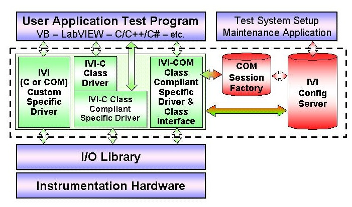

# Driver Architecture

IVI drivers provide many capabilities that go beyond those of
VXIplug\&play drivers. The IVI specifications have been developed to
enable drivers with a consistent and high standard of quality,
usability, and completeness. The specifications define advanced features
such as instrument simulation, state caching, automatic range checking,
and multithread safety.

**Driver Types**

IVI custom specific drivers support only inherent capabilities and
instrument specific capabilities that are not standardized by the
foundation and that are unique to a particular instrument. Inherent
capabilities are described in IVI 3.2: Inherent Capabilities
specification, available on the
[Specifications](../specifications/default.md) Page.

In addition to these inherent and instrument specific capabilities, IVI
drivers can comply with an instrument class specification to support the
foundation's goal of instrument interchangeability.

IVI class-compliant specific drivers contain inherent capabilities, base
class capabilities, as well as class extension capabilities that the
instrument supports. Base class capabilities are common to most
instruments in a class (e.g., edge-triggered acquisition on a scope).
Class extension capabilities represent more specialized features of an
instrument class (e.g., TV or width trigger on a scope).

To achieve interchangeability, users program to an IVI class interface
available through an IVI class-compliant specific driver or a separate
IVI class driver.

  
**IVI System Architecture**

**Driver API**

To support all popular programming languages and development
environments, IVI drivers provide either a IVI-C or an IVI-COM API.
Driver developers may provide both interfaces, as well as wrapper
interfaces optimized for specific development environments.

**Instrument I/O**

All IVI drivers communicate to the instrumentation hardware through an
I/O Library. The VISA library is used for the GPIB and VXI buses, while
other buses can either utilize VISA or another library.

**Shared Components**

IVI Foundation members have cooperated to provide common software
components, called IVI shared components, that ensure multi-vendor
system compatibility. These components provide services to drivers and
driver clients that need to be common to all drivers. For instance, the
IVI Configuration Server enables administration of system-wide
configuration.

To learn more about IVI driver architecture, see the IVI architecture
specifications, available on the
[Specifications](../specifications/default.md) page.
